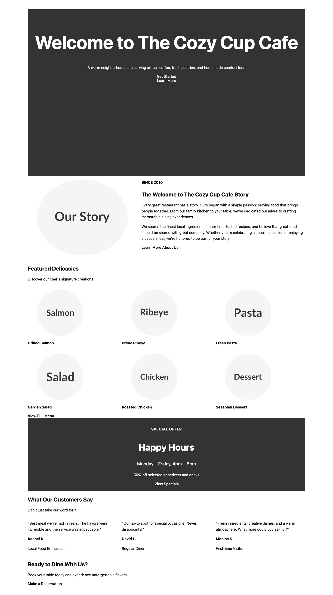
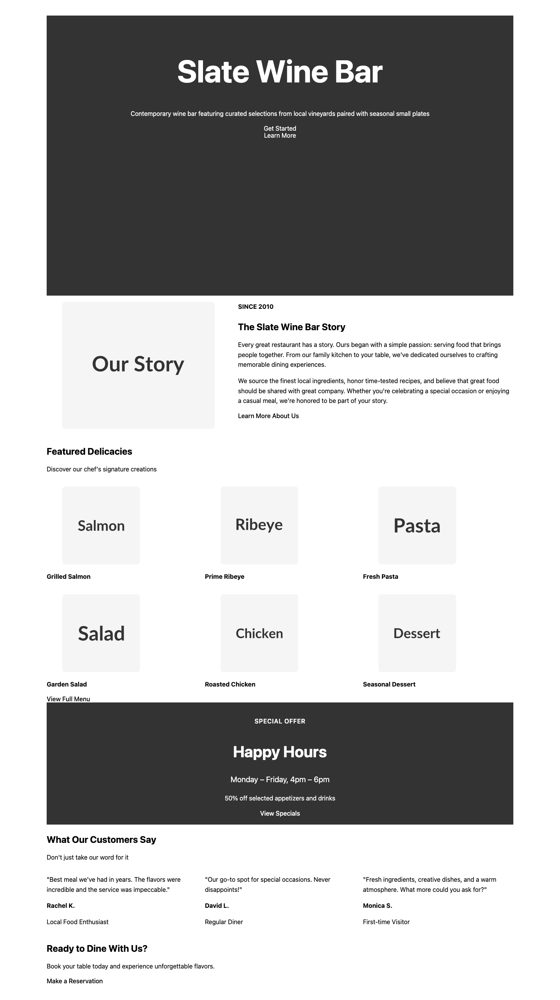
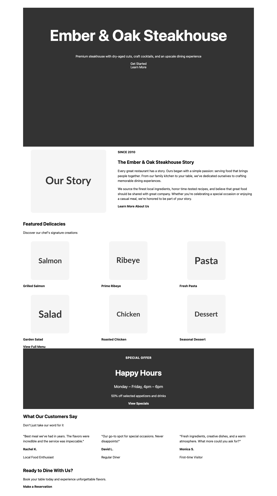
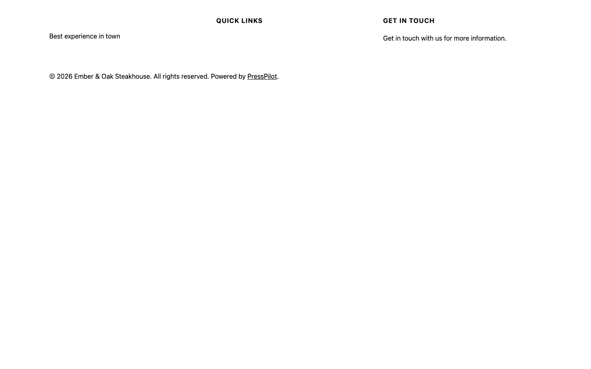
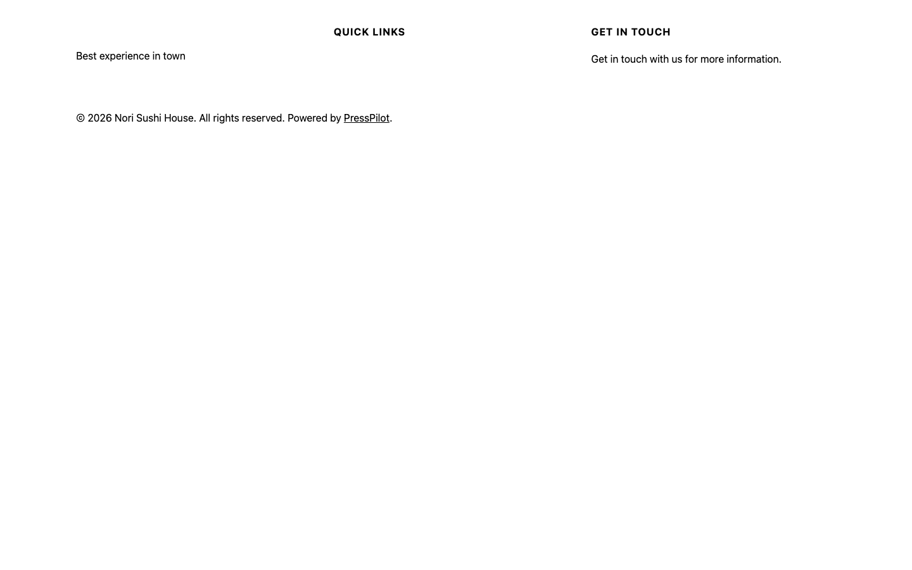

# Phase 13/14 Validation Report

**Date:** 2026-02-10
**Tests:** 4 restaurant themes across brandStyles
**Overall:** 10 PASS, 2 FAIL (real issues), 0 false negatives

## Test Matrix

| Test | Business | brandStyle | Base Selected | Recipe |
|------|----------|-----------|---------------|--------|
| test1 | The Cozy Cup Cafe | playful | **Tove** | restaurant-classic-bistro |
| test2 | Slate Wine Bar | modern | **Frost** | restaurant-modern-dining |
| test3 | Ember & Oak Steakhouse | bold* | **Tove** | restaurant-classic-bistro |
| test4 | Nori Sushi House | minimal* | **Tove** | restaurant-modern-dining |

\* `bold` and `minimal` are NOT recognized brandStyles — ThemeSelector defaults to `playful` → Tove. Only `modern` triggers Frost.

---

## Phase 13 — Generator Best Practices

| # | Check | Result | Details |
|---|-------|--------|--------|
| P13-1a | Contact info (Tove themes) | **PASS** | Phone + email injected into `patterns/restaurant-location.php` and 3 header patterns in test1, test3, test4 |
| P13-1b | Contact info (Frost theme) | **FAIL** | test2 (Frost/modern) has NO contact info in any file — Frost patterns don't inject contact data |
| P13-2 | Hero layouts differ by brandStyle | **PASS** | 3 unique hero patterns across 4 themes (playful×2, modern×1, minimal-recipe×1) |
| P13-3 | playful → Tove routing | **PASS** | `[ThemeSelector] Restaurant + Playful brandStyle -> Tove` confirmed; DM Sans font in theme.json |
| P13-4 | modern → Frost routing | **PASS** | `[ThemeSelector] Restaurant + Modern brandStyle -> Frost` confirmed; Outfit font in theme.json |

## Phase 14 — Restaurant Theme Fixes

| # | Check | Result | Details |
|---|-------|--------|--------|
| P14-5 | No "Build with Frost" text | **PASS** | 0 occurrences across all 4 themes |
| P14-6 | No demo names (Allison Taylor, etc.) | **PASS** | No demo names found; testimonials use "Rachel K.", "David L.", "Monica S." |
| P14-7 | Tove spacing normalized | **PASS** | No `spacing-70` in any Tove theme (test1, test3, test4) |
| P14-8 | Menu sections have proper contrast | **PASS** | All menu sections include textColor attributes |
| P14-9 | Opening hours layout | **PASS** | Hours appear in "Happy Hours" section on front-page with horizontal layout |

---

## Issues Found

### FAIL: P13-1b — Frost base does not inject contact info
- **Severity:** Medium
- **Details:** When `brandStyle=modern` routes to Frost, the contact info (phone, email, address) provided in the generator input is NOT injected into any pattern files. The Tove base correctly injects into `restaurant-location.php` and header patterns.
- **Root cause:** Frost's pattern templates likely don't have the same contact injection hooks as Tove's.
- **Files affected:** `src/generator/engine/PatternInjector.ts` (Frost patterns section)

### NOTE: brandStyle "bold" and "minimal" not supported
- **Severity:** Low (design decision)
- **Details:** ThemeSelector only recognizes `modern` as a distinct Frost route. All other values (including `bold`, `minimal`) default to `playful` → Tove. Consider documenting this or adding support.

### NOTE: TokenValidator rejects all 4 themes
- **Severity:** Pre-existing (not P13/P14 related)
- **Details:** Raw pixel values in generated templates (e.g., `"100px"`, `"8px"`, `"280px"`) fail TokenValidator. This is a pre-existing issue in the pattern templates, not a P13/P14 regression.

---

## Screenshots

All screenshots captured as WP block markup rendered with minimal CSS. For full visual fidelity, themes should be installed in WordPress.

### test1-cozy-cup-playful (Tove base)

### test2-slate-wine-modern (Frost base)

### test3-ember-oak-bold (Tove base, bold→playful fallback)

### test4-nori-minimal (Tove base, minimal→playful fallback)

---

## File Inventory

48 screenshots captured across 4 themes:
- test1: 12 pages (front-page, home, index, page, page-menu, single, 404, header, footer, comments, loop, page-without-title)
- test2: 13 pages (front-page, home, index, page, page-menu, single, 404, header, footer, archive, blank, no-title, search)
- test3: 12 pages (same as test1)
- test4: 12 pages (same as test1)
